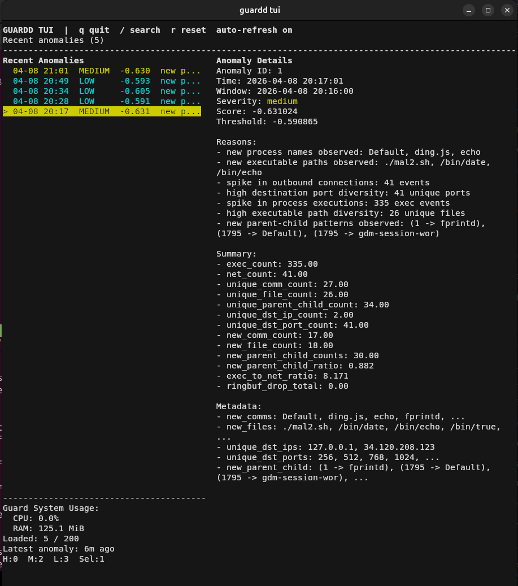

<h1 align="center">guardd</h1>
<p align="center">
Machine learning driven behavioral anomaly detection for Linux using eBPF + Isolation Forest
</p>

---
guardd collects low-level system events (process execution, network activity), aggregates them into time-windowed feature vectors, and detects anomalous behavior using a machine learning model.  

guardd is focused on detected **unknown threats**  

---
<p align="center">
  
</p>

---
> [!WARNING]
> This project is still in development  
> Features and detection accuracy are actively being improved  
> Feedback, suggestions, and contributions are welcome  
---

### Features

eBPF-based kernel telemetry  
Time-windowed behavioral feature aggregation  
Isolation Forest anomaly detection  
Automatic model training and retraining  
Config handled via config.toml  
NDJSON output  
Designed to run as a systemd service  
TUI for checking anomalies  

---

### How it works

guardd runs as a single systemd service that manages the full lifecycle of data collection, training, and detection.

On startup:

If no model exists, guardd begins collecting baseline behavioral data  
It attempts to train a model every 10 minutes until enough data is available  
Once training succeeds, it switches automatically into detection mode  

During operation:

System activity is continuously aggregated into time windows and converted into feature vectors  
Each window is scored by the trained Isolation Forest model  
Anomalies are emitted as NDJSON  

Ongoing:

The model is retrained automatically once per week  
Detection resumes immediately after retraining with the updated model  

---

### Installation

#### 1. Clone the repository

```
git clone https://github.com/benny-e/guardd.git
cd guardd
``````

#### 2. Run the install script

```
sudo bash install.sh
```

This will:

Install system dependencies  
Copy the project to /opt/guardd  
Create a Python virtual environment  
Install the package  
Build eBPF components  
Install the systemd service  

---

### Usage

#### Start service

```
sudo systemctl start guardd.service
```

#### Check status

```
systemctl status guardd.service
```

#### View logs

```
journalctl -u guardd.service -f
```
---

#### Terminal TUI

guardd includes a terminal UI for browsing recent alerts and searching anomalies  

To launch: (after starting guardd.service)
```bash
guardd tui
```

---

### Running without systemd

You can run `guardd` directly from the command line without installing the systemd service. This can be configured to run with other init systems  

#### Run full daemon 

```bash
sudo guardd daemon
```

#### Run individual components

Collect data:
```bash
sudo guardd collect
```

Train model:
```bash
sudo guardd train
```

Run Detection:
```bash
sudo guardd detect
```
---
### Configuration

guardd supports configuration via a `config.toml` file.

By default, the daemon looks for:

```
/opt/guardd/config.toml
```

#### Example

```toml
[daemon]
mode = "auto"
bootstrap_retry_seconds = 60
retrain_interval_seconds = 604800

[training]
min_training_rows = 1
contamination = 0.01
n_estimators = 200
threshold_percentile = 10.0

[paths]
db_path = "/opt/guardd/data/features.db"
model_path = "/opt/guardd/data/model.bundle"
guardd_path = "/opt/guardd/ebpf/guardd"
```

#### [daemon]

Controls the lifecycle of guardd.

 mode  
   -`"auto"` → full pipeline (collect → train → detect)  
   -`"collect"` → only collect data  
   -`"detect"` → only run detection (requires model)  

 bootstrap_retry_seconds  
   -How often guardd attempts initial training when no model exists  
   -During this phase, guardd collects data and periodically pauses to try training  

 retrain_interval_seconds  
   -How often the model is retrained after initial bootstrap  
   -Default: 7 days (604800 seconds)  


#### [training]

Controls model behavior and requirements.  

 min_training_rows  
   -Minimum number of feature windows required to train  
   -If not met, training fails and will retry later  

 contamination  
   -Expected proportion of anomalies in the data  
   -Passed directly to Isolation Forest  
   -Typical values: `0.01`–`0.05`  

 n_estimators  
   -Number of trees in the Isolation Forest  
   -Higher = more accurate, slower training  

 threshold_percentile  
   -Determines anomaly cutoff score  
   -Lower = more aggressive detection  


#### [paths]

Controls where guardd reads/writes data.  

 db_path  
   -SQLite database storing feature vectors and anomalies

 model_path  
   -Serialized model bundle used for detection

 guardd_path  
   -Path to the eBPF collector binary


#### Notes

 Config values override CLI defaults   
 CLI arguments can still override config if explicitly provided  

---

### Dependencies

#### System

python3  
python3-venv  
python3-pip  
clang  
llvm  
libbpf-dev  
libelf-dev  
bpftool  
build-essential  
pkg-config  
sqlite3  

