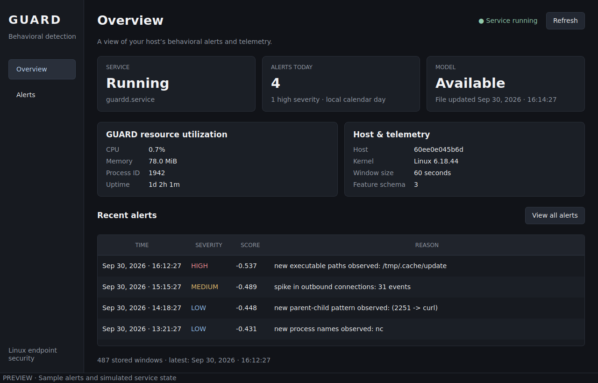
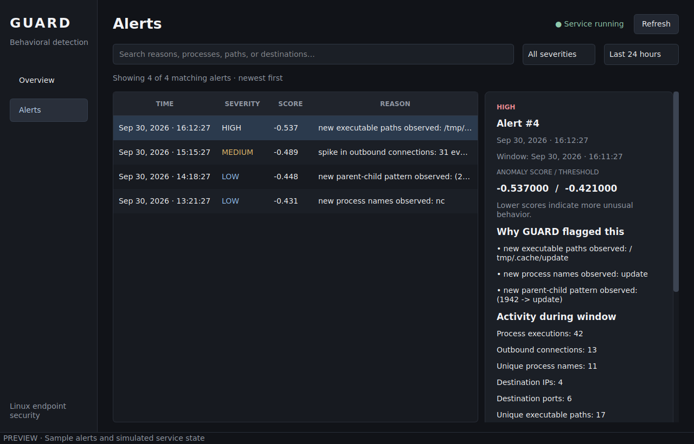
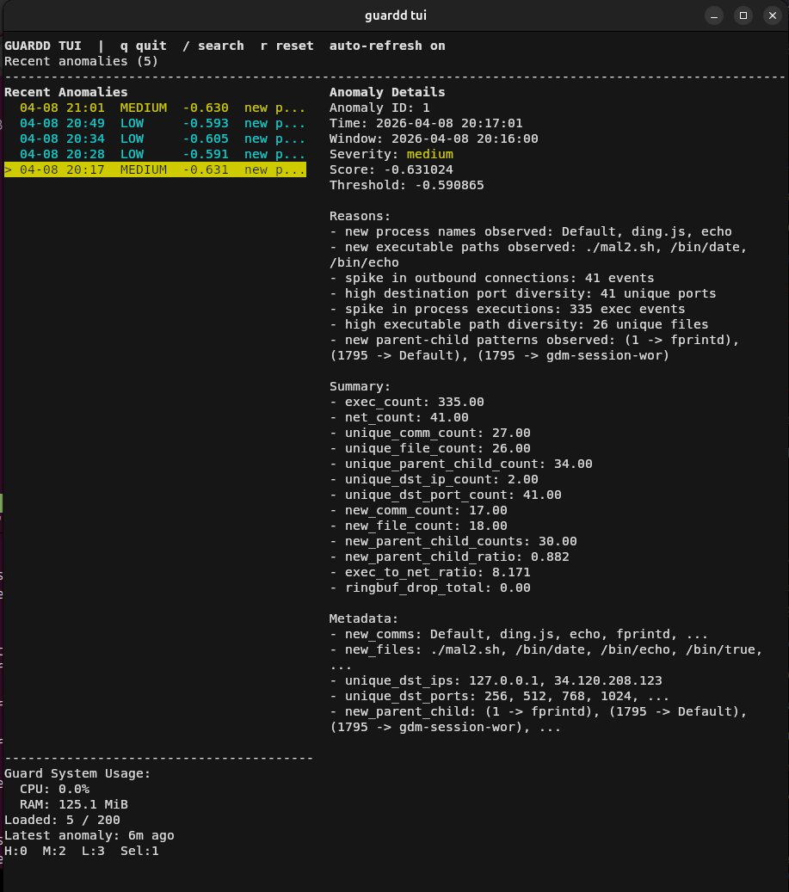

<p align="center">
  
</p>

<h1 align="center">Guardd</h1>

<p align="center">Behavioral anomaly detection for Linux, powered by eBPF and machine learning.</p>

<p align="center">
  
  
  <a href="LICENSE"></a>
</p>

Guardd learns how a Linux host normally behaves and flags activity that differs
from that baseline. Kernel sensors collect process executions and outbound TCP
connection attempts; an Isolation Forest scores the resulting one-minute
activity windows. Alerts include the score, behavioral context, and explanations
to help you investigate.

A background daemon handles collection, training, and detection. The desktop
GUI and terminal interface let you inspect alerts and resource usage while the
daemon continues running.

**Status:** experimental and under active development. Detection quality depends
on the workload, baseline, and sensitivity settings.

[Installation](#installation) · [Usage](#usage) · [Configuration](#configuration) ·
[How it works](#how-it-works) · [Updating](#updating) · [Troubleshooting](#troubleshooting)

## Features

- **Kernel telemetry:** process names, executable paths, users, parent process
  IDs, and outbound IPv4 TCP destinations and ports.
- **Behavioral detection:** activity counts, diversity, and novelty scored
  against a fixed reference baseline.
- **Automatic lifecycle:** initial collection, model training, detection, weekly
  retraining, and model reloads in one systemd service.
- **Persistent alerts:** SQLite storage with scores, severity, explanations,
  feature summaries, and context; alerts are also emitted as newline-delimited JSON.
- **Desktop GUI:** Overview and Alerts pages, search, severity and time filters,
  detailed alert inspection, and automatic refresh.
- **System visibility:** service state, CPU and memory use, PID, uptime, host and
  kernel information, aggregation window size, and telemetry freshness.
- **Desktop integration:** a Guardd application-menu launcher and penguin icon.
- **Terminal access:** a curses TUI and commands for collecting, training,
  scoring, and inspecting telemetry directly.

## Screenshots

### Desktop overview



### Alert investigation



The desktop screenshots use sample alerts and a simulated service state.

### Terminal interface



## Installation

### Requirements

The supplied installer uses `apt-get` and systemd. Ubuntu 24.04 LTS is a practical
starting point; Debian systems need equivalent packages. Other distributions
require manual dependency installation.

- Python **3.11 or newer** available as `python3`. Ubuntu 22.04's default Python
  3.10 does not meet the package requirement.
- A Linux kernel with eBPF, BTF at `/sys/kernel/btf/vmlinux`, and the required
  process and socket tracepoints.
- Clang/LLVM, libbpf development headers, libelf, a C build toolchain, and
  **`bpftool`** for generating kernel headers and BPF skeletons.
- Root privileges for installing the service and running the sensors.
- A graphical desktop session for the optional PySide6 GUI.

On Ubuntu, install Git and the kernel tools before running the installer:

```bash
sudo apt-get update
sudo apt-get install -y git linux-tools-common "linux-tools-$(uname -r)"
python3 --version
bpftool version
test -r /sys/kernel/btf/vmlinux && echo "Kernel BTF available"
```

The kernel-tools package must match your running kernel. On Debian, `bpftool` is
available as a separate package. The installer supplies the other build and
Python dependencies, but does not explicitly install `bpftool`.

### Install the daemon and desktop GUI

```bash
git clone https://github.com/benny-e/guardd.git
cd guardd
sudo bash install.sh --gui
```

For a headless installation, run `sudo bash install.sh` instead.

The installer copies the application to `/opt/guardd`, creates its virtual
environment, builds the eBPF collector, installs `/usr/local/bin/guardd`, and
enables `guardd.service` at boot. It **does not start the service**. With `--gui`,
it also installs Qt runtime dependencies, the desktop launcher, and the icon.

### Set the installed paths

Before the first start, open the installed configuration:

```bash
sudoedit /opt/guardd/config.toml
```

Set its `[paths]` section to absolute paths:

```toml
[paths]
sensor_path = "/opt/guardd/ebpf/guardd"
db_path = "/opt/guardd/data/features.db"
model_path = "/opt/guardd/data/model.bundle"
```

The repository config uses relative paths. Those work from the service's
`/opt/guardd` working directory, but a desktop launcher can start elsewhere.
Absolute paths let the daemon, GUI, and CLI use the same data.

Review the training settings in [Configuration](#configuration), then start:

```bash
sudo systemctl start guardd.service
systemctl status guardd.service
sudo journalctl -u guardd.service -f
```

The first run collects data before a model is available. An active service can
still be in this collection phase; check its logs for training and detection.

## Usage

### Desktop GUI

Open **Guardd** from your application menu, or run:

```bash
guardd gui
```

Run the GUI as your regular desktop user. It reads the existing database and
refreshes every five seconds. Closing it leaves the daemon running.

| Page | What you can do |
| --- | --- |
| **Overview** | Check the service, alerts today, model-file availability, CPU/memory usage, PID, uptime, host/kernel details, 60-second window size, and recent telemetry. Select a recent alert to inspect it. |
| **Alerts** | Search process names, paths, destinations, and reasons; filter by severity and the last 24 hours, 7 days, 30 days, or all time; select an alert to view its score, threshold, explanations, activity, and context. |

Use **Refresh** for an immediate update. Times use your local timezone, and
Overview's daily totals cover the local calendar day independently of filters.

To choose a different database or increase the displayed alert limit:

```bash
guardd gui --db-path /opt/guardd/data/features.db --model-path /opt/guardd/data/model.bundle --limit 500
```

The GUI is a read-only viewer: collection, training, and service control happen
through the daemon and CLI. Model availability means a file exists, not that its
contents are valid or that detection has started. The GUI does not load pickled
models. Resource metrics cover the entire systemd service, including the sensor;
100% CPU represents one logical core. The first CPU reading needs two samples.

### Terminal interface

```bash
sudo guardd tui
```

The TUI refreshes every two seconds and shows alert details and daemon stats.
Unlike the GUI, it initializes storage through a writable database connection;
the standard root-owned installation can require `sudo`.

| Key | Action |
| --- | --- |
| `↑` / `k`, `↓` / `j` | Select an alert. |
| `/` | Search; press Enter to apply or Esc to cancel. |
| `r` | Clear the search and return to the first alert. |
| `q` / Esc | Quit. |

### Service management

```bash
sudo systemctl stop guardd.service
sudo systemctl start guardd.service
sudo systemctl restart guardd.service
systemctl status guardd.service
sudo journalctl -u guardd.service -n 100 --no-pager
sudo journalctl -u guardd.service -f
```

Restart the service after editing its configuration. Enable or disable startup
at boot with `sudo systemctl enable guardd.service` or
`sudo systemctl disable guardd.service`.

### CLI and manual operation

Run one collector at a time. Stop the systemd service before manually collecting
or detecting, and stop a manual collector before training its model.

| Command | Purpose |
| --- | --- |
| `guardd` or `guardd daemon` | Run the automatic collect → train → detect lifecycle. |
| `guardd daemon --mode collect` | Collect windows without automatic training. |
| `guardd daemon --mode detect` | Score windows using an existing compatible model. |
| `guardd collect` | Collect live windows into SQLite. |
| `guardd train` | Train a model from stored windows and print its summary. |
| `guardd detect` | Score live windows and emit alerts. |
| `guardd ingest` | Print parsed sensor events for debugging. |
| `guardd gui` / `guardd tui` | Browse alerts in the desktop or terminal interface. |

From the standard installation, a manual workflow is:

```bash
sudo systemctl stop guardd.service
sudo guardd collect --sensor-path /opt/guardd/ebpf/guardd --db-path /opt/guardd/data/features.db
# Press Ctrl+C after collecting enough representative activity.
sudo guardd train --db-path /opt/guardd/data/features.db --model-out /opt/guardd/data/model.bundle
sudo guardd detect --sensor-path /opt/guardd/ebpf/guardd --db-path /opt/guardd/data/features.db --model-path /opt/guardd/data/model.bundle
```

Press Ctrl+C to stop manual detection, then restart the systemd service to resume
background operation. For a foreground automatic daemon, use
`sudo guardd daemon`. For raw telemetry, use
`sudo guardd ingest --sensor-path /opt/guardd/ebpf/guardd --pretty`.

Append `--help` to any command for its options. Detection supports
`--print-all-scores`, `--print-features`, `--print-windows`, and `--no-store`.
`--no-store` disables feature-window writes; detected anomalies are still stored.

## Configuration

Guardd loads the **first existing** file in this order:

1. `./guardd.toml` in the current working directory.
2. `/etc/guardd/config.toml`.
3. `/opt/guardd/config.toml`.

Files are not merged. The checkout's `config.toml` is a template, not an
automatically discovered development config. For a local setup, copy it to
`guardd.toml` and adjust the paths.

Here is an installed-system example with frequent bootstrap attempts and a
larger initial training period:

```toml
[paths]
sensor_path = "/opt/guardd/ebpf/guardd"
db_path = "/opt/guardd/data/features.db"
model_path = "/opt/guardd/data/model.bundle"

[logging]
debug = false

[daemon]
mode = "auto"
bootstrap_retry_seconds = 600
retrain_interval_seconds = 604800
print_windows = false
print_features = false
print_all_scores = false
no_store = false

[train]
min_training_rows = 1380
baseline_fraction = 0.2
limit = 50000
contamination = 0.01
n_estimators = 200
random_state = 42
threshold_percentile = 10.0

[gui]
limit = 200

[tui]
limit = 200
```

| Setting | Meaning |
| --- | --- |
| `[paths] sensor_path` | Compiled eBPF collector executable. |
| `[paths] db_path` | SQLite database for feature windows and alerts. |
| `[paths] model_path` | Trained model bundle used by detection. |
| `[daemon] mode` | Automatic lifecycle by default. Select `collect` or `detect` explicitly with `guardd daemon --mode ...`; see the parser-precedence note below. |
| `[daemon] bootstrap_retry_seconds` | Delay between initial training attempts while collecting. The repository config uses `82800` seconds (23 hours); the example above uses `600`. |
| `[daemon] retrain_interval_seconds` | Automatic retraining interval; `604800` is seven days. |
| `[daemon] print_windows`, `print_features`, `print_all_scores` | Extra window, feature, and non-anomalous score output in the logs. |
| `[daemon] no_store` | Skip feature-window storage during detection; alerts are still stored. |
| `[train] min_training_rows` | Minimum model-fit windows, excluding windows reserved for the reference baseline. |
| `[train] baseline_fraction` | Earliest fraction of selected windows reserved for the fixed baseline; default `0.2`, strictly between 0 and 1. |
| `[train] limit` | Maximum selected feature rows. Selection is currently chronological from oldest to newest, so the limit takes the earliest rows. |
| `[train] n_estimators` | Number of Isolation Forest trees; default `200`. More trees increase training work without guaranteeing better detection. |
| `[train] random_state` | Seed for reproducible model training; default `42`. |
| `[train] threshold_percentile` | Low-score percentile used as Guardd's alert cutoff; default `10.0`. **Lower values produce a stricter cutoff and generally fewer alerts.** |
| `[train] contamination` | Passed to Isolation Forest; default `0.01`. Guardd uses raw scores and its own percentile cutoff, so this does not set its alert rate. |
| `[gui] limit`, `[tui] limit` | Maximum matching alerts displayed; default `200` each. |
| `[logging] debug` | Debug logging where supported; `--debug` explicitly enables it on daemon and sensor commands. |

The repository config sets `min_training_rows = 1380`. With a 20% reference
fraction, this requires at least **1,724 total windows**: 344 reference windows
and 1,380 model-fit windows, approximately 29 hours at one-minute intervals.
The first successful training attempt can occur later depending on the retry
interval. Built-in settings without a config use a much smaller minimum of ten
model-fit windows; that is useful for a smoke test, not a representative baseline.

Most options use CLI values before config values and built-in defaults. Some
current parser defaults also take precedence when their flags are omitted:
`daemon --mode`, `daemon --contamination`, and `daemon --debug`, plus the paths on `collect`,
`detect`, and `ingest`. Select modes explicitly and use the absolute-path CLI
examples above for individual commands. `daemon` and `gui` resolve their paths
from configuration.

For standalone commands, output settings can also live in `[collect]`,
`[detect]`, and `[ingest]` using the corresponding `print_windows`,
`print_features`, and, for detection, `print_all_scores` and `no_store` keys.
`[ingest] pretty = true` enables indented event JSON.

## How it works

1. **Observe:** eBPF sensors emit process executions, outbound IPv4 TCP connection
   attempts, and sensor counters as structured events.
2. **Aggregate:** Python groups activity into 60-second host windows. Features
   cover event counts, unique users/processes/paths, parent–child pairs,
   destination diversity, execution/network ratios, drops, and novelty.
3. **Train:** the earliest 20% of selected windows establish a reference baseline.
   Novelty for the later windows is recalculated against that fixed reference,
   using the same extractor as detection. Those later windows fit the Isolation
   Forest and determine the score cutoff.
4. **Detect:** each live window is scored against the model's frozen baseline.
   Scores below the cutoff become alerts. Repeated unseen behavior remains new
   until a different model and baseline are loaded.
5. **Refresh:** auto mode pauses detection for scheduled retraining, writes the
   bundle atomically, and resumes. Detection also checks for updated bundles
   every five completed windows.

Lower scores mean more unusual behavior. Scores and severity labels are not
probabilities that an attack occurred. Alert explanations describe observations
such as new processes or connection spikes; they are heuristic context, not a
formal explanation of the model's decision.

| Installed path | Contents |
| --- | --- |
| `/opt/guardd/data/features.db` | `feature_windows` and `anomalies` tables. SQLite may also create `-wal` and `-shm` files. |
| `/opt/guardd/data/model.bundle` | Pickled model, feature schema, threshold, training details, and reference baseline. Load only trusted bundles. |
| `/opt/guardd/config.toml` | Installed runtime configuration. |
| `/opt/guardd/ebpf/guardd` | Compiled kernel-telemetry collector. |
| `/etc/systemd/system/guardd.service` | Background-service unit. |

Successful CLI/daemon training prunes feature windows older than 45 days;
it does not prune alert history. Raw events are printed by `ingest` and are not
stored by default. Process paths and destination addresses are present in
window metadata, but command arguments and network payloads are not captured.

## Updating

Use a targeted update for an existing installation. The current installer
resyncs the checkout, can replace the installed `config.toml`, and recreates the
virtual environment, so rerunning it is not the update workflow.

After pulling or applying your changes in the checkout, close the GUI and run:

```bash
sudo systemctl stop guardd.service
sudo rsync -a --exclude '__pycache__' guard/ /opt/guardd/guard/
sudo cp pyproject.toml README.md /opt/guardd/
sudo /opt/guardd/.venv/bin/python -m pip install -e '/opt/guardd[gui]'
sudo install -m644 systemd/guardd.service /etc/systemd/system/guardd.service
sudo systemctl daemon-reload
sudo systemctl start guardd.service
guardd gui
```

For a headless installation, omit `[gui]` from the pip command and the final
`guardd gui`. If sensor source changed, copy `ebpf/` into `/opt/guardd/ebpf/` and
run `sudo make -C /opt/guardd/ebpf clean` followed by
`sudo make -C /opt/guardd/ebpf` while the service is stopped, before
starting it again. These targeted copies leave your config and data in place.

Auto mode rebuilds incompatible legacy models from stored observations. If
there are insufficient windows, it collects more and retries. Explicit detect
mode requires a successful `guardd train` first. Version-3 feature rows contain
the context needed for recalculating novelty; current model bundles are version 2.

### Add the GUI to an existing installation

First update its application source using the steps above. On Ubuntu/Debian,
install the Qt runtime libraries if they are not already present:

```bash
sudo apt-get install -y libegl1 libgl1 libxkbcommon0 libxkbcommon-x11-0 libxcb-cursor0 libxcb-icccm4 libxcb-image0 libxcb-keysyms1 libxcb-render-util0
```

Then add a launcher for your account from the checkout, **without sudo**:

```bash
install -Dm644 desktop/guardd.desktop "$HOME/.local/share/applications/guardd.desktop"
install -Dm644 guard/gui/assets/guardd.png "$HOME/.local/share/icons/guardd-flat.png"
sed -i "s|^Icon=.*|Icon=$HOME/.local/share/icons/guardd-flat.png|" "$HOME/.local/share/applications/guardd.desktop"
```

The launcher uses `/usr/local/bin/guardd gui`; change `Exec` and `TryExec` if your
command is installed elsewhere. Its direct PNG path also avoids stale themed
icons. Repeat the icon-copy command when changing the icon.

## Troubleshooting

| Symptom | What to check |
| --- | --- |
| Service runs but no model exists | Check logs for bootstrap training attempts. Collect enough windows for both the reference and model-fit periods. |
| No alerts appear | Confirm the database path, time filters, and service logs. Collection produces no scored alerts; detection may also have found no anomalies. |
| GUI reports a missing or unreadable database | Use absolute `[paths]`; check access to the data directory, database, and SQLite `-wal`/`-shm` files. Grant access through your group/ACL policy and keep the GUI running as your desktop user. |
| GUI cannot import PySide6 | Install the optional extra with `/opt/guardd/.venv/bin/python -m pip install -e '/opt/guardd[gui]'` using `sudo` for the standard installation. |
| Qt platform-plugin error | Install the runtime libraries listed above and launch inside a graphical desktop session. |
| GUI CPU/memory is unavailable | Install the current service unit, run `systemctl daemon-reload`, and restart the service. It enables CPU and memory accounting. Manual daemon runs are not tracked by the GUI's systemd metrics. |
| Old icon or application name | Install the per-user launcher above. Ensure its `Name=Guardd`; if the desktop still caches the old entry, log out and back in. |
| eBPF build or attachment fails | Check `bpftool version`, kernel BTF availability, build dependencies, root privileges, and service logs. |
| Standalone command uses the wrong files | Pass explicit `--sensor-path`, `--db-path`, and `--model-path` as applicable; review config discovery and parser defaults. |

For service failures, start with:

```bash
sudo journalctl -u guardd.service -n 100 --no-pager
```

Service status in the GUI refers to `guardd.service`. If systemd cannot be
queried, status is unknown; a manually started daemon is not identified as that
service. No model or alerts during initial collection is expected.

## Development

Install the system build dependencies and `bpftool` first. From a checkout with
Python 3.11 or newer:

```bash
python3 -m venv .venv
.venv/bin/python -m pip install -e '.[gui]'
.venv/bin/python -m pip install pytest
make -C ebpf
cp config.toml guardd.toml
```

Edit `guardd.toml` for your development paths and training settings. Run the
collector/daemon with privileges and the GUI as your desktop user:

```bash
sudo .venv/bin/guardd daemon
.venv/bin/guardd gui --db-path data/features.db --model-path data/model.bundle
```

For headless development, install `-e .` without the GUI extra. Run the Python
checks without a graphical display:

```bash
QT_QPA_PLATFORM=offscreen .venv/bin/python -m pytest -q
```

Qt interaction tests skip when PySide6 is absent. These checks use fixtures and
do not establish live sensor coverage or detection accuracy; test kernel
attachment and representative workloads on the target host separately.

| Directory | Responsibility |
| --- | --- |
| `ebpf/` | Kernel sensors, C collector, and build rules. |
| `guard/ebpf/` | Event schema and sensor-process reader. |
| `guard/pipeline/` | Window aggregation, features, baselines, and explanations. |
| `guard/model/`, `guard/training/` | Model training, loading, inference, and training-data access. |
| `guard/storage/` | SQLite feature and alert storage. |
| `guard/gui/` | Optional PySide6 desktop client and icon. |
| `desktop/`, `systemd/` | Application launcher and service packaging. |
| `tests/` | GUI, storage, CLI, and novelty-training regression checks. |

## Current limitations

- Unusual activity is not necessarily malicious. Validate alert quality against
  normal workloads and controlled detection scenarios.
- Network telemetry currently covers outbound **IPv4 TCP attempts**, not IPv6,
  UDP, transferred bytes, or proof of a successful connection.
- Detection aggregates the whole host into minute windows. It does not provide
  complete process ancestry, event-sequence analysis, or automated blocking.
- Parent–child identities currently use the numeric parent PID and child name;
  PID changes can introduce novelty during ordinary activity.
- Retraining uses stored windows without reviewed benign/malicious labels;
  it is not a curated feedback loop.
- This is a local Linux monitor with local interfaces; there is no central
  management server or remote GUI API.

## Contributing

Issues and pull requests are welcome at
[benny-e/guardd](https://github.com/benny-e/guardd). For a bug report, include your
distro, kernel and Python versions, relevant settings, reproduction steps, and
sanitized logs. Keep event, feature, and model-bundle schema changes explicitly
versioned, and include regression coverage for behavior changes.

## License

Guardd is licensed under the [MIT License](LICENSE).
